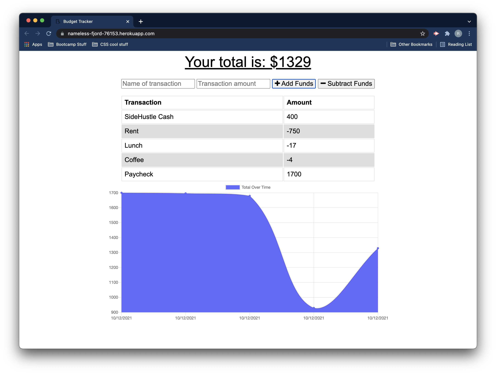

# BudgetTracker

## Description

Budget Tracker is a Node.js application that uses Express.js and MongoDB to track a budget. Budget Tracker is a Progressive Web Application that can be used on and offline with the help of service workers.

## Usage

Budget Tracker has been hosted on [Heroku](https://nameless-fjord-76153.herokuapp.com/) and you can install it on any device from your browser. 

The Github Repo can be found [here](https://github.com/rjr2/BudgetTracker).

## Screenshots

## Contributors

Front end code was provided by UofR Fullstack Bootcamp. This is a completed repo and I am the sole contributor.

## License

MIT